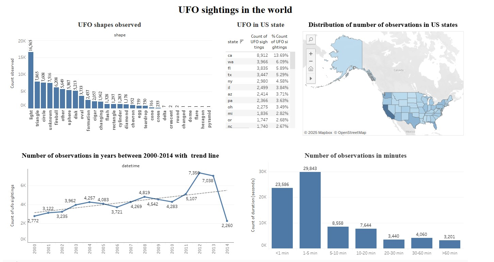

# UFO-sightings-dashboard
## Project Overview
This project presents an analysis of UFO sightings from 1949 to 2014. The analysis aims to answer questions such as what shapes of UFOs are most frequently observed, the timing of UFO sightings, the trend of UFO sightings from year to year, and which US states report the highest number of UFO sightings. This is an educational project aimed at consolidating knowledge from online courses.
## Technologies Used
* **SQL**: Used to clean and structure data queries to prepare a dataset for visualization. 
* **Tableau**: Used to design dashboard visualization
## Insights and Conclusions
The UFO sightings Dasboard provides several key insights:

* The most frequently observed UFO shapes are lights which accounts for more than 20% of all sightings

* The number of UFO sightings has been on an upward trend since 2000

* The highest number of UFO sightings can be seen in California which accounts for almost 14% of all sightings in the United States. The high number in California may be due to a combination of factors, including its large population, the presence of airports and military bases, favorable weather conditions, cultural interest in paranormal phenomena, and military activity and technology testing. Many of these sightings may have rational explanations, but some remain puzzling and contribute to California's reputation for high UFO activity. The number of sightings in the 10 states where there have been the highest number of UFO phenomena accounts for more than 53% of all sightings in the entire United States.

* About 56% of all UFO sightings have a sighting time of less than 5 minutes

* Most UFO phenomena are observed near airports and military bases. The media is trying to give more and more publicity to various phenomena leading to a snowball effect and an increase in reported UFO phenomena
## How to use
To interact with the dashboard:

1. Download the repository to your machine.
2. Open the `.twbx` file in [Tableau Desktop](https://www.tableau.com/products/desktop/download) (14 days trial) to perform Data Analysis or see the visualization on my profile at Tableau Public [Tableau Public](https://public.tableau.com/app/profile/marcin.wawrzyniak/vizzes)
## Data Visualization Using [Tableau](https://public.tableau.com/app/profile/marcin.wawrzyniak/viz/UFO_sightings-Dashboard/Dashboard1)

## Data Source
The dataset was sourced from National UFO Reporting Center
(License: Public Domain)
